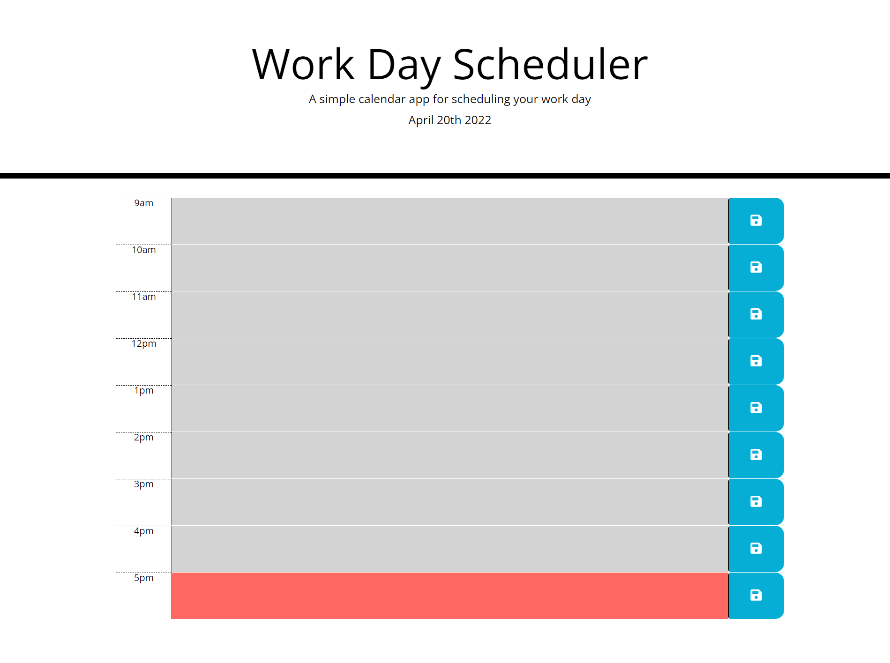

### Day-Planner

The [Day-Planner](https://wahabahmadi.github.io/Day-Planner/) web page is specifically designed to help with organizing an employe's day. I this page you will that there is only 9 hours is givin to the employee for to do their work everyday. 
The Day-Planner web page is designed to indicate the past, present and future times in different colors. 
The past time is indicated in light gray color, the present time is indicated in red color and the future times are indicated in green color. The purpose of different colors are to make it easier to indicate and understanding to past, present and future tasks. 
 
 

### Here is a screenshot of Day-Planner web page.

### Click [here](https://wahabahmadi.github.io/Day-Planner/) to be directed to the Day-Planner web page.
